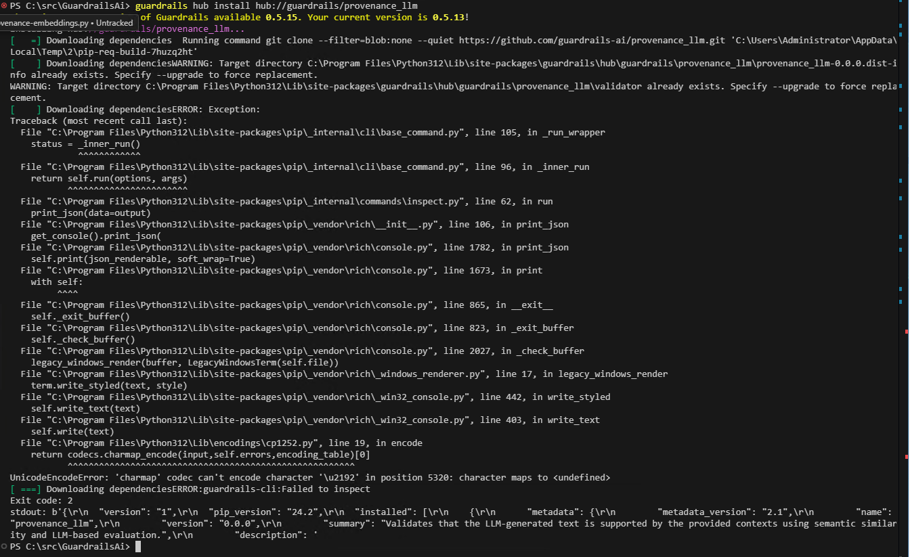
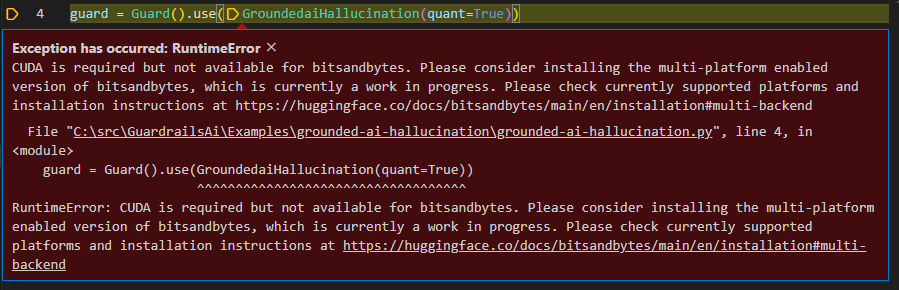

# Use Supported LLMs

https://www.guardrailsai.com/docs/how_to_guides/using_llms#azure-openai

Basic usage of Azure OpenAI service => basic-usage:

* `basic-usage.py`
* `basic-usage-streaming.py`
* `basic-usage-function.py` => Buggy

---

# Gibberish Text

https://hub.guardrailsai.com/validator/guardrails/gibberish_text

This validator validates the "cleanliness" of the text generated by a language model. It uses a pre-trained model to determine if the text is coherent and not gibberish. The validator can be used to filter out text that is not coherent or does not make sense.

```powershell
guardrails hub install hub://guardrails/gibberish_text
```

---

# Toxic Language

https://hub.guardrailsai.com/validator/guardrails/toxic_language

This validator uses the pre-trained multi-label model from Detoxify to check whether the generated text is toxic.

```powershell
guardrails hub install hub://guardrails/toxic_language
```

---

# Profanity Free

https://hub.guardrailsai.com/validator/guardrails/profanity_free

This validator ensures that there’s no profanity in any generated text. 

```powershell
guardrails hub install hub://guardrails/profanity_free
```

---

# Provenance Embeddings

https://hub.guardrailsai.com/validator/guardrails/provenance_embeddings

This validator uses embedding similarity to check if an LLM generated text can be supported by the sources. 

```powershell
guardrails hub install hub://guardrails/provenance_embeddings
```

---
---

# Provenance LLM => buggy

https://hub.guardrailsai.com/validator/guardrails/provenance_llm

This validator uses an LLM callable to evaluate the generated text against the provided contexts.

```powershell
guardrails hub install hub://guardrails/provenance_llm
```



---

# Grounded AI Hallucination => buggy

This validator uses a fine-tuned language model to detect hallucinations in AI-generated responses. It evaluates whether a given response is grounded in the provided context or if it contains factually incorrect or nonsensical information.

```powershell
guardrails hub install hub://groundedai/grounded_ai_hallucination
```



---
